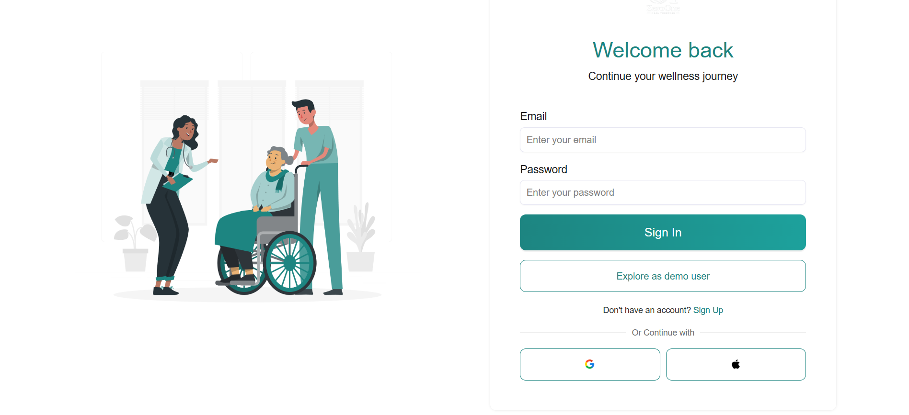
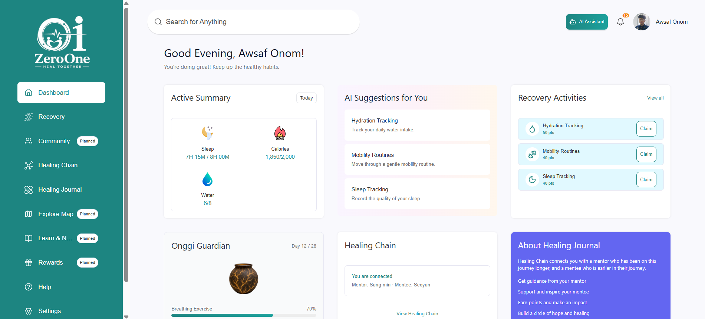
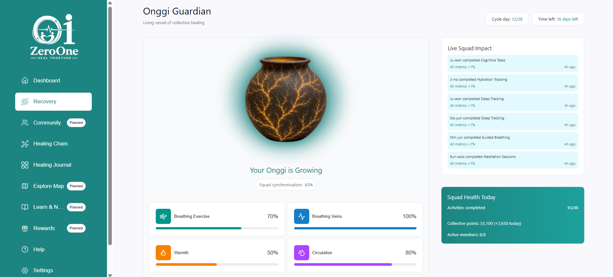
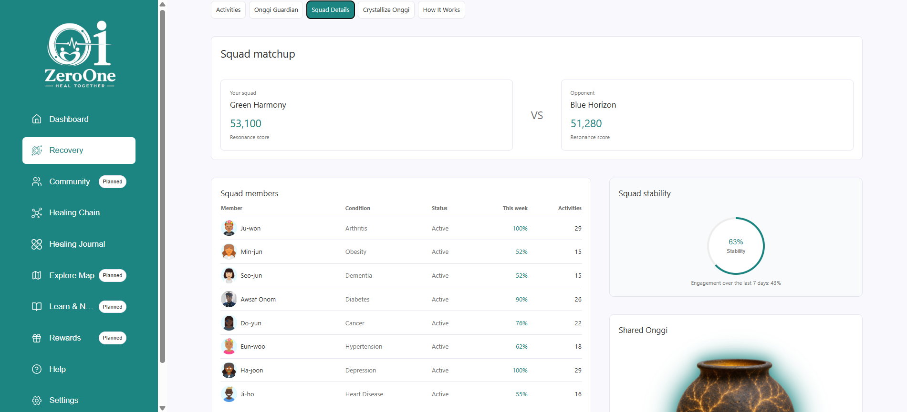
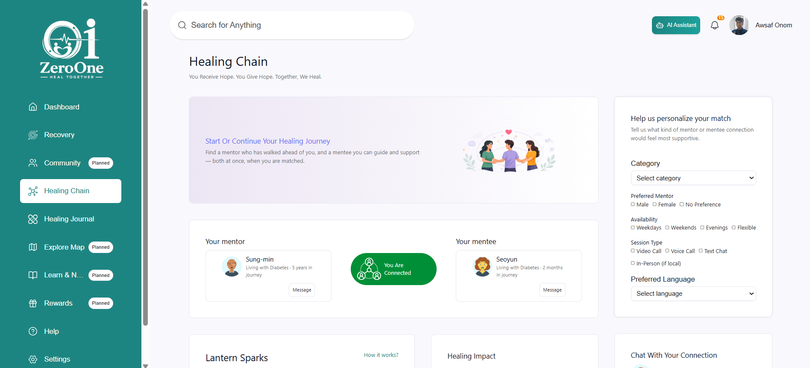
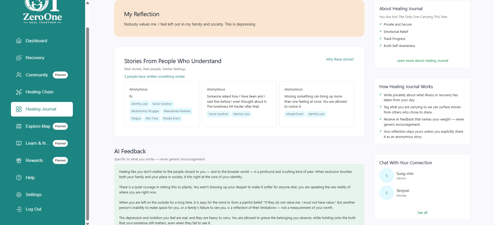
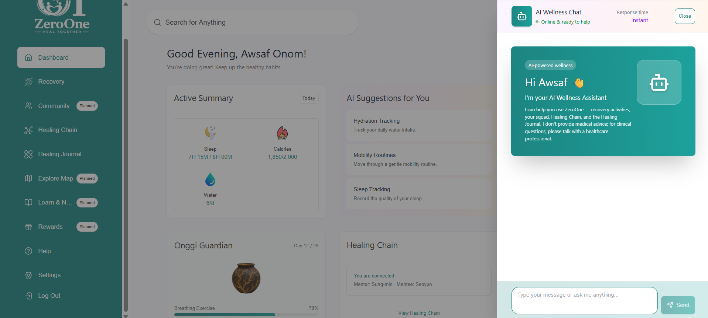

<div align="center">

# ZeroOne

**A collective recovery platform where eight people with different health conditions share a squad and grow a shared artifact — the Onggi — through daily activities.**

</div>

A collective recovery platform where eight people with **different** health conditions share a squad and grow a shared artifact — the Onggi — through daily activities.

Most recovery apps optimize for one condition and one user. ZeroOne deliberately mixes conditions in a fixed-size squad: your breathing exercise nudges the same vessel your squadmates see, and the causal link between individual action and collective state is visible in the UI. Healing Chain adds a second loop — every matched user is both mentor and mentee — so support flows in both directions.

I built ZeroOne because I wanted this product to exist — auth, onboarding, squad mechanics, journal, assistant, and realtime updates wired end to end. Several nav items are still roadmap stubs with design previews.

**Live site:** [zeroone.vercel.app](https://zeroone.vercel.app) — on the login page, click **Explore as demo user** (no signup required).

---

## Screenshots

| Login | Dashboard |
|---|---|
|  |  |

| Onggi Guardian | Squad details |
|---|---|
|  |  |

| Healing Chain | Healing Journal |
|---|---|
|  |  |

| AI Assistant |
|---|
|  |

---

## What is built

**Auth and onboarding** — Firebase email/password login and signup, one-click login via **Explore as demo user**, multi-step onboarding (role, profile, conditions, wellness, habits), squad assignment with one condition per member enforced server-side.

**Dashboard** — daily health summary, squad snapshot, impact feed, links into recovery and support resources.

**Recovery** — activity grid with claim/complete/freeze (6-hour lock), Onggi Guardian (five squad-level dimensions + resonance score), squad details, live impact feed, crystallization view, how-it-works explainer. Onggi state updates run in a server transaction and broadcast over Socket.io; the client refetches on reconnect rather than replaying events.

**Healing Chain** — mentor and mentee connections, lantern sparks (config-driven point values), journey timeline, impact panels, mentor/mentee profile pages. Chain Chat has API routes for encrypted messages but the UI is still a roadmap stub.

**Healing Journal** — private reflections (owner-scoped at the query layer), mood and emotional tags, peer stories matched by emotional overlap, AI feedback with crisis detection before any model call.

**AI Assistant** — slide-over chat from any screen; diet/exercise advice requests are redirected locally without calling a model.

**Settings** — profile, health conditions (primary condition locked while in an active squad), habits, account info, password change.

**Notifications** — in-app list with read state.

**Realtime** — Socket.io rooms per squad (`squad:{squadId}`); activity completion emits Onggi and impact updates.

## What is planned

These routes render roadmap pages (`apps/web/src/components/roadmap/`) with Figma design previews and a **Planned** badge in the sidebar — not working product:

- **Community** — condition channels, peer feed, professional events
- **Explore Map** — healing spaces, air quality, Pulse Point check-ins
- **Learn & News** — health alerts, lessons, global health map (includes **Diet Advice** as a sub-route)
- **Rewards** — Pulse Points, levels, redemptions
- **Talk to Doctor** — verified professionals, booking, live sessions
- **Global Resonance** — world map of active squads (linked from Recovery)
- **Chain Chat** — encrypted mentor/mentee messaging UI (API partially exists)

Not started in code: Social Brain Health games, Emotional Ritual system, Time Capsule contributions (crystallization page shows empty state), full Diet Advice tracking.

---

## Presentation Slides

The full deck of presentation for better understanding.

<details open>
<summary><b>View all 20 slides</b></summary>

<br>


 


 

</details>

---

## Architecture

```
Browser (React 18 + Vite + TanStack Query)
    │  HTTPS REST  /api/v1/*
    │  WebSocket   Socket.io
    ▼
Express API (apps/api)
    ├── Firebase Admin  — verify ID tokens
    ├── Prisma 7        — ORM + migrations
    ├── Anthropic Claude API  — journal feedback + assistant (switchable to Gemini via AI_PROVIDER)
    └── Socket.io       — squad realtime
    ▼
PostgreSQL (Supabase)
```

Shared types, game constants, and design tokens live in `packages/shared`.

Monorepo layout:

| Workspace | Role |
|-----------|------|
| `apps/web` | React client, PWA |
| `apps/api` | Express API, Prisma, AI, realtime |
| `packages/shared` | `ZEROONE_CONFIG`, API types, tokens |

---

## Technical decisions

**Server-authoritative Onggi state.** Activity completion runs in a Prisma transaction: claim status, dimension deltas, impact events, and resonance score are computed on the server (`apps/api/src/services/activityCompletion.ts`). The API emits a Socket.io payload; clients treat the server as source of truth and refetch squad state after reconnect instead of merging partial event streams.

**Owner-scoped journal privacy.** Reflections, AI feedback, and journey milestones are filtered by authenticated `userId` in every query. A missing or foreign reflection ID returns `404`, not `403`, so IDs cannot be probed. Published peer stories expose only anonymized body text and emotional tags — no name, mood, or timestamps. See [docs/journal-privacy.md](docs/journal-privacy.md).

**Crisis detection before the model.** Journal saves and assistant turns run a local pattern check (`apps/api/src/ai/crisis.ts`) before any Claude/Gemini call. On match, the API returns crisis support resources and skips the LLM. This is keyword-based, not clinical assessment — false positives and false negatives are possible.

**Config-driven game constants.** Squad size (8), cycle length (28 days), freeze duration (6 hours), spark point values, lantern threshold (1,000), and related limits live in `packages/shared/src/config.ts` as `ZEROONE_CONFIG`. Route handlers and the seed import these values instead of hardcoding literals.

---

## Local setup

Requires Node.js 20+, a PostgreSQL database (local or Supabase), and a Firebase project with Email/Password auth enabled.

```bash
git clone <repo-url>
cd ZeroOne
npm install
```

`npm install` runs `prisma generate` via postinstall and **does not require a `.env` file** — a placeholder database URL is used for code generation only.

Copy and fill environment files:

```bash
cp apps/api/.env.example apps/api/.env
cp apps/web/.env.example apps/web/.env
```

**API (`apps/api/.env`)** — at minimum: `DATABASE_URL`, `DIRECT_URL`, Firebase Admin credentials (`FIREBASE_PROJECT_ID`, `FIREBASE_CLIENT_EMAIL`, `FIREBASE_PRIVATE_KEY`). For AI features: `ANTHROPIC_API_KEY` or `GEMINI_API_KEY` plus `AI_PROVIDER`. For the **Explore as demo user** button: `DEMO_EMAIL` matching a Firebase user.

**Web (`apps/web/.env`)** — `VITE_API_ORIGIN` (default `http://localhost:3001`), Firebase web config (`VITE_FIREBASE_*`), and optionally `VITE_DEMO_EMAIL` / `VITE_DEMO_PASSWORD` for that login button.

Apply schema and seed:

```bash
cd apps/api
npx prisma migrate dev
npm run prisma:seed
cd ../..
```

Start both apps:

```bash
npm run dev:api   # http://localhost:3001
npm run dev:web   # http://localhost:5173
```

Verify a production build from a clean tree:

```bash
npm run build
```

Optional: set `AMBIENT_SQUAD_ACTIVITY=true` in `apps/api/.env` to simulate squad member activity through the real completion pipeline. Deployment to Vercel + Railway + Supabase is documented in [docs/deployment.md](docs/deployment.md).

---

## Squad activity

On the live deployment, squad activity can include **simulated members** when `AMBIENT_SQUAD_ACTIVITY` is enabled on the API. Those completions are real database writes through the same code path as human claims, not client-side animations.

---

## License

Source code is [MIT licensed](License).

The Figma designs, Onggi artwork, and the ZeroOne name and logo are **not** licensed for reuse.

## Further reading

- [Product brief](docs/product-brief.md) — game rules and terminology
- [API reference](docs/api.md)
- [Data model](docs/data-model.md)
- [Journal privacy](docs/journal-privacy.md)
- [Deployment](docs/deployment.md)
